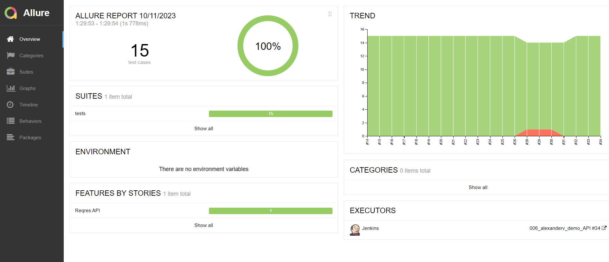

## Demo project with Python tests for API service [reqres.in](https://reqres.in/) 

&nbsp;

### Tools and technologies:

### Test coverage

The following HTTP methods tested:
1. POST - create user
2. GET - retrieve single user / multiple users
3. PATCH - update user
4. PUT - update user
5. DELETE - delete user

The following verifications conducted:
1. Response code and schema (where applicable)
2. Response content
3. Request validity (data correctness in body/parameters, well-formed json in body)

Pytest parameterization and pytest fixtures used in project.

Example of test case (*GET users* request) in Allure Report:

&nbsp;

### Jenkins settings
**Jenkins** is used for test runs.
Jenkins job configuration is below:

&nbsp;

### Test Launch
To run tests, go to [Jenkins job](https://jenkins.autotests.cloud/job/006_alexanderv_demo_API_Allure_TestOps/) and click 'Build now'.

&nbsp;

Additionally, integration with **Allure TestOps** added into same Jenkins job.
So you can run Jenkins job with all the tests or specify individual tests to run via Allure TestOps.

&nbsp;

Select individual tests or test groups by their allure decorators: e.g. Update User - Put
( @allure.feature('Update User') , @allure.story('Put') )

&nbsp;

### Test Report and Test Documentation

Reporting is implemented with **Allure services**.

[Allure Report](https://jenkins.autotests.cloud/job/006_alexanderv_demo_API/34/allure/) can be opened from Jenkins, see screenshot below. It displays charts, test executions details, different kinds of attachments (logs, jsons, response codes, etc.).

&nbsp;
&nbsp;

**Allure TestOps** also contains such information. 
Also it's generating Test Documentation that can be imported to Jira.
    
&nbsp;
&nbsp;

### Jira integration

Test Cases and Allure Launches have been integrated with Jira Task:
&nbsp;

### Test Results Notification
When test run finished, telegram message with the following data is sent:

* total amount of tests and run duration
* percentage of passed/failed/skipped etc. tests
* link to the test run report

&nbsp;

The following tool is used for sending notifications: [allure-notifications library](https://github.com/qa-guru/allure-notifications).
Telegram bot was created and added to a specific telegram group

(many different notifications supported: Telegram, Slack, Skype, Email, Mattermost, Discord, Loop)

### How to run tests locally

#### Pre-requisites:
* git, python3 and allure (Java also needed) installed

#### Steps:
1. clone repository to your local machine
~~~
git clone https://github.com/AlexanderVaraksa/demo_api_tests
~~~
2. create and activate virtual environment 
~~~
python -m venv .venv
source .venv/bin/activate             # for MacOS
source .venv\Scripts\activate         # for Windows
~~~
3. install dependencies
~~~
pip install -r requirements.txt
~~~
4. run all tests
~~~
pytest .
~~~

After test run is finished, use command below to generate allure report

for MacOS:
~~~
allure serve
~~~

for Windows:
~~~
allure.bat serve
~~~
As a result, you will see Allure report as above
(can be closed by Ctrl+C)
